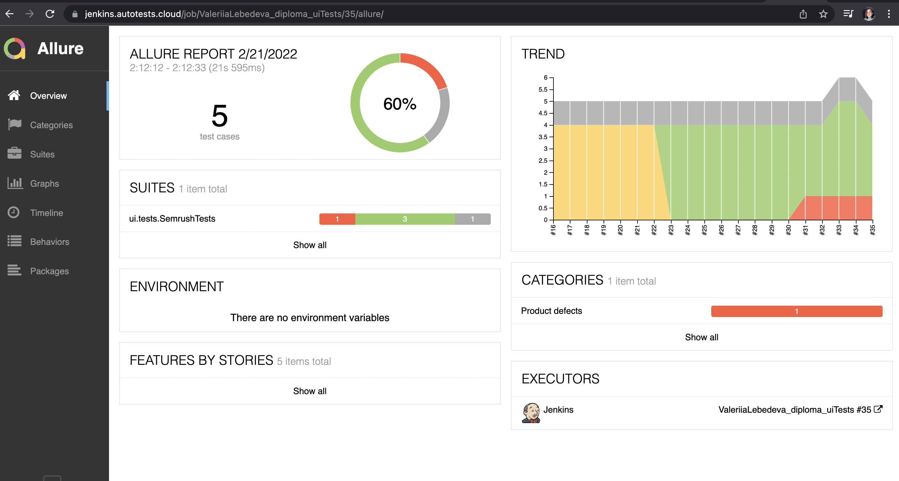
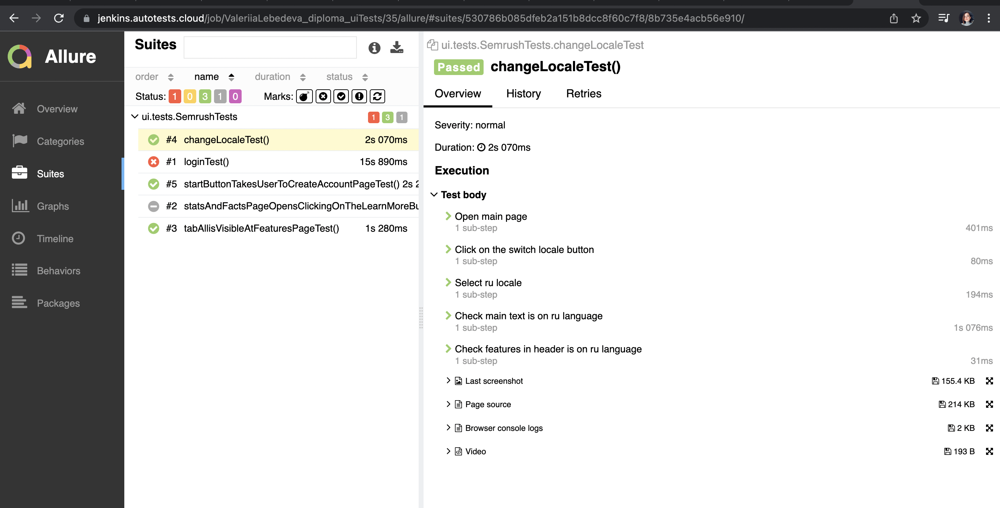
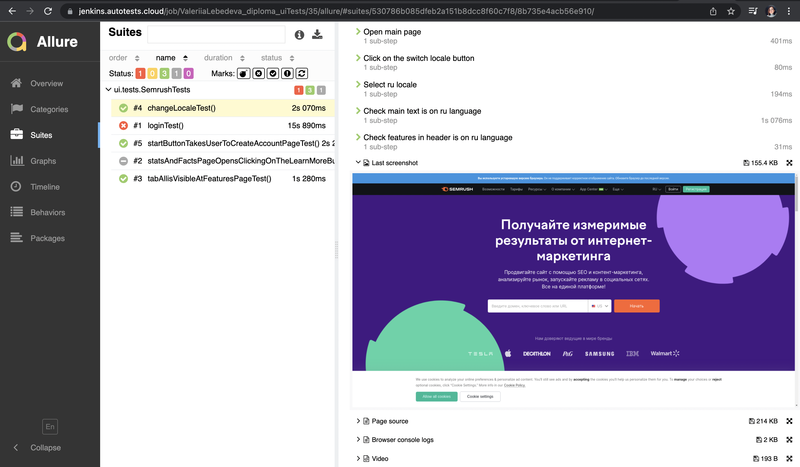
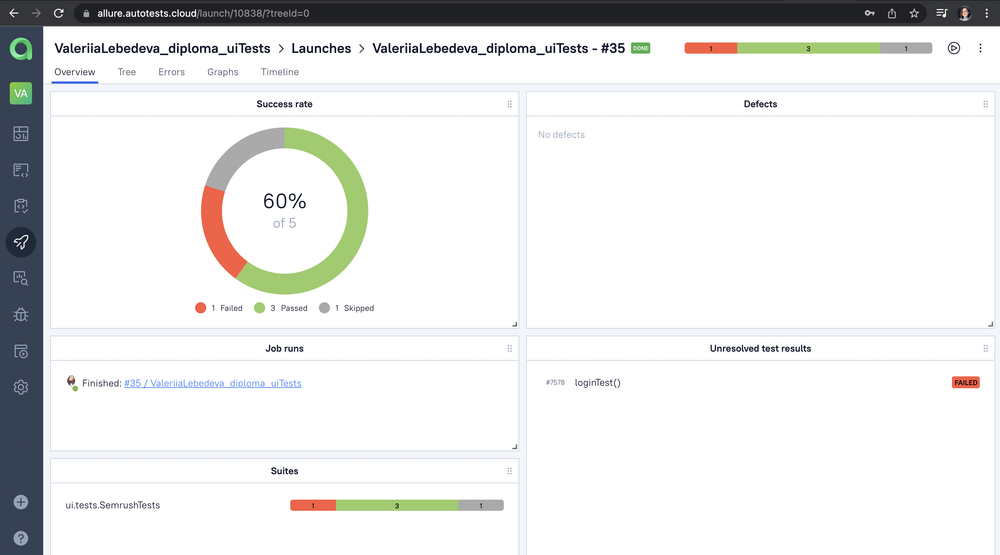
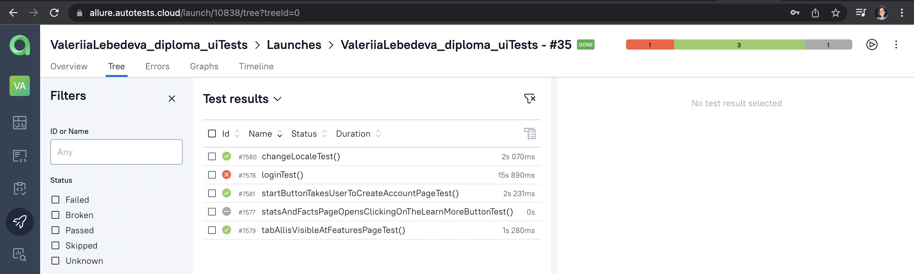
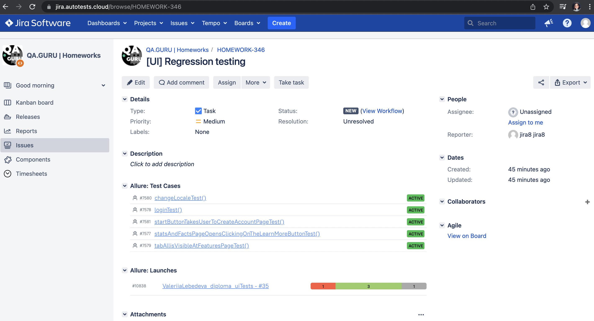
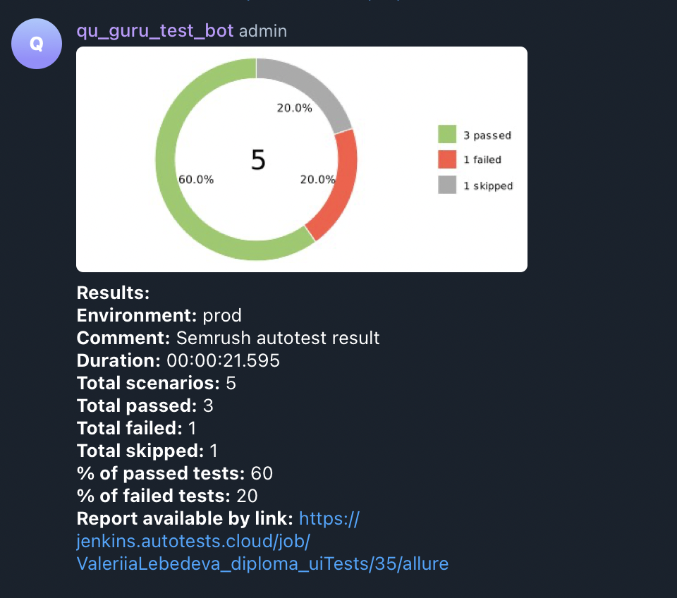

# Semrush UI autotests 
https://www.semrush.com/

# Test-cases
1. Successful log in test
2. Change locale test
3. Features page: 'choose your area of interest' first tab has text 'All' test
4. Click on the 'Start now' button takes user to 'Create account' page test
5. Click on the 'Learn more' button takes user to 'Stats and facts' page

# USAGE examples
## Run tests from terminal
##### (Don't forget to add the configuration files:
##### - src/test/resources/config/credentials.properties
##### - src/test/resources/config/semrush.properties
##### see congig files examples here: src/test/resources/config)

### Run tests with filled remote properties:

```bash
gradle clean test
```

### Run tests with not filled remote properties:

```bash
gradle clean test -Durl=selenoid.autotests.cloud/wd/hub/
```


### Serve report:

```bash
allure serve build/allure-results
```

# Jenkins job
https://jenkins.autotests.cloud/job/ValeriiaLebedeva_diploma_uiTests/

How to build project: 
1. Click on the 'Build with parameters'
2. Click on the 'Build' button

# Allure report examples

<p align="center">
  
</p>

Each test has steps described:
<p align="center">
  
</p>

Each test has last screenshot attached:
<p align="center">
  
</p>

Another attachments you may find here:
https://jenkins.autotests.cloud/job/ValeriiaLebedeva_diploma_uiTests/35/allure/

(select suits item -> select test -> enjoy :innocent:)

# Allure TestOps integration

<p align="center">
  
</p>

<p align="center">
  
</p>

# Jira integration

<p align="center">
  
</p>


# Telegram notifications
The project is configured to send launch results notifications to Telegram channel:

<p align="center">
  
</p>

